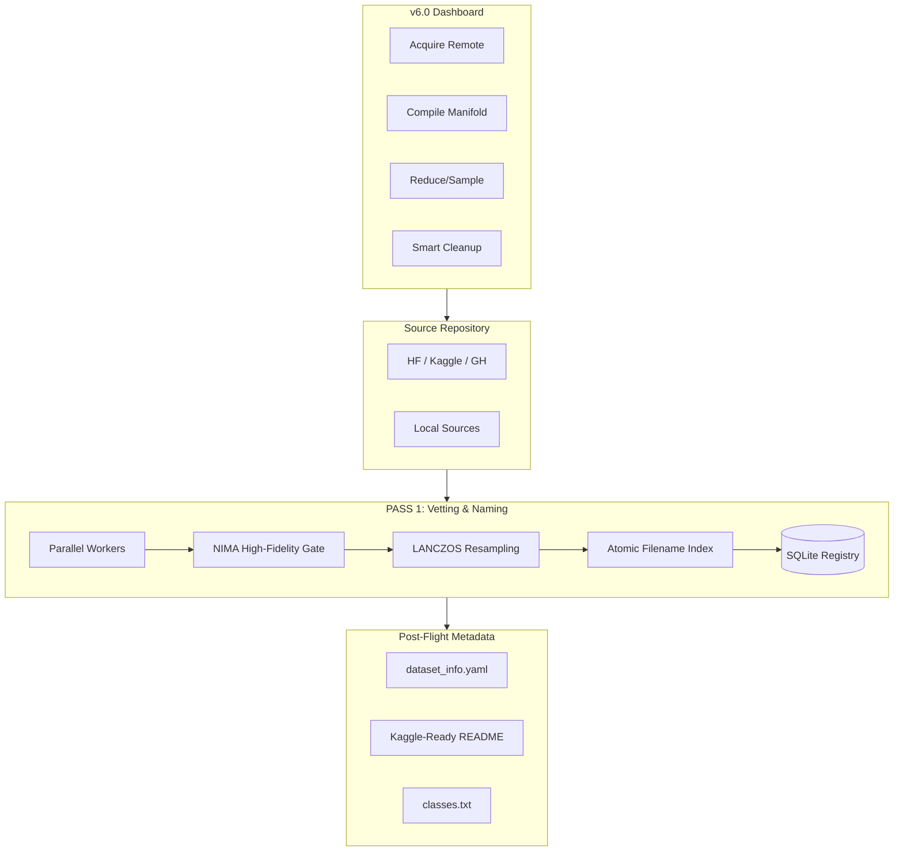

# LemGendary Dataset Pipeline (v16.3.0-MODERNIZED)

> **The Industrial Standard for Generative & Vision Data Synthesis.**
>
> Elevate from static sharding to a **Self-Optimizing Generative Manifold**. Orchestrate massive-scale Diffusion and Vision datasets with industrial-grade CLIP styling, multi-domain balancing, and high-fidelity **LANCZOS** interpolation.

---

## Mission Status: v16.3.0 (Modernized Manifold Standard)

**Project Repository**: [lemgendary-dataset-generator](https://github.com/lemgenda/lemgendary-dataset-generator)

**Status**: High-Fidelity Compilation Active / 1.4M Manifold Stability Verified
**Current Goal**: Transition all manifolds to the **suffix-free 2026 naming standard** and modernize the physical storage layer.

---

## v16.3.0 Release: Modernized Manifold Standard

The v16.3.0 release retires the legacy `Large` suffix from every manifold folder. New compilations produce suffix-free names by default (`LemGendized<Name>`), and existing manifolds are migrated via the new `[MODERNIZE]` operation.

### Core Changes

- **Suffix-Free Naming**: `LemGendizedNimaAestheticLarge` → `LemGendizedNimaAesthetic`. All 20 production manifolds are eligible for migration.
- **Relative `dataset_info.yaml` Paths**: All `path:` fields are now written as portable relative paths (`../LemGendaryDatasets/<name>`) rather than absolute Windows paths, enabling seamless Kaggle session portability.
- **Kaggle Slug Rename Protocol**: Modernization performs a full re-upload to Kaggle under the new slug. `kaggle_ref` in `unified_data.yaml` is updated programmatically. Old Kaggle datasets remain accessible but are no longer referenced.
- **Backward-Compatible Task Maps**: `MANIFOLD_TASK_MAP` retains legacy `*Large` entries so existing not-yet-migrated manifolds continue to resolve their task type correctly.
- **Reduction Filter Relaxation**: `manifold_reduce.py` eligibility no longer hard-requires the `Large` suffix, and correctly handles both naming conventions simultaneously.

### Migration Path

| Legacy Name | Modern Name |
| :--- | :--- |
| `LemGendizedForexUniverseLarge` | `LemGendizedForexUniverse` |
| `LemGendizedNimaAestheticLarge` | `LemGendizedNimaAesthetic` |
| `LemGendizedNimaTechnicalLarge` | `LemGendizedNimaTechnical` |
| `LemGendizedYoloV8nLarge` | `LemGendizedYoloV8n` |
| `LemGendizedProfessionalMultitaskRestorationLarge` | `LemGendizedProfessionalMultitaskRestoration` |

Once all eligible manifolds are migrated, `unified_data.yaml` `name_suffix` becomes `""` and every subsequent compilation automatically produces suffix-free folder names.

---

## v16.2.8 SOTA Tier: Nuclear Performance & Fidelity

The v16.2.8 release introduced the **High-Fidelity Compiler**, optimized for processing 1.4M+ item manifolds while maintaining absolute structural integrity for restoration tasks.

### High-Velocity Optimizations

- **O(1) Physical Skip-Indexing**: Transitioned from slow recursive traversals to string-based `os.scandir` logic. The compiler skips already-processed samples with near-zero latency, even on massive 1M+ item manifolds.
- **LANCZOS High-Fidelity Scaling**: Native integration of Lanczos resampling for all resolution-locked tasks (Diffusion/VLM), ensuring zero feature aliasing during the downsampling phase.
- **High-Fidelity Floor (v16.2.8)**: Mandatory resolution filtering to prevent low-res "blur" pathologies.
  - **Quality & Diffusion**: Enforced **512px** minimum floor.
  - **Restoration & SR**: Enforced **224px** minimum floor.
- **ThreadPoolExecutor Zero-IPC**: Streamlined execution model that eliminates Windows IPC serialization bottlenecks, maximizing throughput on high-speed NVMe hardware.
- **1024px SOTA Baselines**: Standardized diffusion manifold resolution to 1024px for native SDXL/Flux compatibility.

### Hybrid Cloud & Registry Integration

- **Atomic Registry Resumption**: Integrated SQLite-based checkpoints allow for instantaneous resumption of interrupted 1M-sample runs without redundant I/O.
- **KaggleHub & HF Sync**: Automated synchronization of compiled manifolds to Kaggle/HF via native API managers (`kaggle_manager.py`, `hf_manager.py`).
- **Real-Time Cloud Extraction Tracking & Disk Cleanup (v16.6.1)**: Upgraded post-upload telemetry with version-specific server-side extraction tracking in `kaggle_manager.py` and `manifold_sync.py`. Pre-detects target version increments ($V_{\text{target}}$) to prevent premature exit against historical dataset readiness, rendering a live, cyan byte-level `tqdm` progress bar with uncompressed file count telemetry until cloud extraction reaches 100% Ready. Automatically purges staging archives, dangling temporary files, and duplicate `~/.cache/kagglehub` directories, preventing tens of gigabytes of disk leakage.
- **Direct Root Streaming & Bidirectional Resumption (v16.7.0)**: Eliminates the legacy intermediate extraction cache and secondary byte-copy bottleneck ("FINALIZING" phase). Ingestion streams remote archives directly to the datasets root directory (`LemGendaryDatasets\`) via Kaggle API binary chunking. Smart single-level extraction automatically identifies root manifold folders to prevent double-nesting (`LemGendizedParseNetLarge/LemGendizedParseNetLarge`), with single-row terminal progress tracking (`dynamic_ncols=True`, `file=sys.stdout`). The bidirectional resumption protocol preserves archives upon transfer or extraction interruptions:
  - **Download Resumption**: Pre-scans for existing valid archives on disk, verifies structural integrity via CRC/central directory checks, and resumes extraction of only missing files without redundant network I/O. Source archives are unlinked strictly after 100% successful extraction.
  - **Upload Resumption**: Preserves generated `.staging_<manifold>/<manifold>.zip` archives upon upload failure or connection resets. Subsequent retry operations detect valid existing archives and bypass recompression, saving 30–60 minutes of compute on multi-gigabyte manifolds.
- **Standardized `dataset_info.yaml`**: Every manifold generates a suite-compliant metadata package for immediate ingestion by the LemGendary Training Suite.
- **Decoupled Documentation Generation (v16.4.1)**: Extracted all dataset documentation generation (`README.md`, `dataset_info.yaml`, `category.txt`, `classes.txt`, `index.json`) from the monolithic compiler pipeline into a dedicated `doc_generator.py` module for robust maintainability and standardized outputs. It dynamically generates model-specific architecture mapping and extrapolated baseline metric tables directly from `models_metadata` and `task_metadata` residing in `unified_data.yaml`.
- **UPNv2 Large Space-Recovery (v16.2.9)**: Autonomously purged **1.36 million empty labels** and compiled physical **NTFS hardlinks** in `targets/` mapping back to `images/` on duplicate synthetic structures, successfully recovering **~1.06 TB** of disk space with zero pipeline disruption.

### Multi-Modal & Format Resilience

- **Parquet & Safetensors Support**: Native ingestion of highly compressed pyarrow binaries and model metadata (Kohya/Civitai tags).
- **DPED Mirroring v2.1**: Automated alignment of synthetic and real-world restoration pairs (Smartphone vs. Canon) using the specialized DPED cache.
- **VRAM De-fragmentation**: Proactive memory purging during NIMA/YOLO vetting to prevent OOM on 4GB-8GB local hardware.
- **Universal Film Restorer Dataset Hardening**: Confirmed exactly **0 empty label files** and **100% target physical hardlinking** in `LemGendizedFilmRestorerLarge`, guaranteeing a pristine production state at 0 bytes disk overhead.
- **Professional Multi-Task Restoration Dataset Integration (v16.3.0)**: Structured unified source pipeline merging 11 individual manifolds with automated filename prefix preservation (e.g. `ProfessionalMultitaskRestoration_deblur_compiled_...`) for downstream regular expression routing. Standardized target hardlinking layout with case-insensitive physically skip-indexed ingestion, and configured strict Lanczos/interpolation ceilings at 256px-640px to feed the Mixture-of-Experts (MoE) routing engine.
- **ParseNet Semantic Extraction (v16.3.1)**: Compiler explicitly outputs `masks/` directory, resolving paired masks as target images natively for face segmentation tasks rather than generic YOLO polygons.
- **RetinaFace YOLO Landmarking (v16.3.1)**: Integrated dynamic 5-point landmark extraction directly from `landmarks/` into standard YOLO format and strictly filtered all classes to `face` (index 0).
- **Forex & Financial Time-Series Automated Acquisition (v16.5.0)**: Integrated direct MetaTrader 5 (MT5) IPC pipeline fallback and synthetic multi-regime generator spanning 2019 to Present. When compiling `forex_predictor`, the compiler intelligently fetches missing currency pair shards via MT5 into strictly isolated 4-symbol manifolds (TitanCore, G7Majors, HighBeta, Universe) with zero cross-manifold hardlinking to ensure pristine modularity. The compiler builds a strict 1-Year Progressive Chronological Walk-Forward matrix (Fold 1: 2019-2020, Folds 2-6: 1-Year subsequent blocks) to eliminate physical temporal data duplication, synchronizing shards end-to-end for dynamic stacking in the Training Suite.
- **Forex Parquet Manifold Architecture & Zstandard Compression (v16.6.0)**: Migrated `LemGendizedForexUniverseLarge` from loose uncompressed `.npy` arrays into unified, self-contained `ForexUniverse{year}.parquet` files compressed with Zstandard (level 3). Slashed physical manifold footprint by 99.3% (~738 GB down to ~5.2 GB), completely eliminating NTFS 4KB cluster slack space and 600,000+ tiny array files. Implemented memory-bounded chunked streaming in `mt5_pipeline.py` and `convert_forex_manifold.py` with 100% bit-exact tensor parity verification against original floating-point arrays.

---

## Synthesis Flow (v6.2)



---

## Developer Interface

### 1. The Dataset Hub (v5.3.0-SOTA)

The modernized interactive dashboard for end-to-end manifold management:

```powershell
./lemgendary_datasets_hub.ps1
```

Dashboard operations:

- **`1. [COMPILE]`**: Build new SOTA manifold across Vision and Forex models.
- **`2. [REDUCE]`**: Create downsampled variants with custom fold and timeframe selection.
- **`3. [SYNC]`**: Kaggle Manifolds Sync submenu:
  - **`1. [SYNC] Sync to Kaggle`**: Pre-archives manifolds exceeding 50 files with real-time byte progress, uploads via KaggleHub, and monitors server extraction.
  - **`2. [GET]  Get from Kaggle`**: Downloads precompiled LemGendized manifolds from Kaggle and automatically extracts archives to local dataset storage.
- **`4. [MODERNIZE]`**: Retire the legacy `Large` suffix from manifold folder names. Renames folders in place, regenerates metadata, re-uploads to Kaggle under modern slugs, and updates `unified_data.yaml` (`name_suffix` and `kaggle_ref`) programmatically. Fully interactive; safe; requires typing `YES` to confirm.
- **`Q. [QUIT]`**: Exit Dashboard.

### 2. Manual Orchestration

The python engine supports direct CLI hooks for automation via its modular, decoupled architecture (`compiler_core.py`):

```bash
# Core Compilation Engine
python manifold_compile.py --model nima_aesthetic --max_gb 50 --suffix Large
python manifold_compile.py --workers 16    # Override auto-detected worker cap
python manifold_compile.py --no-labeling  # High-Speed Mode (Bypass YOLO)

# Reduction Engine
python manifold_reduce.py --reduce --max_gb 10

# Kaggle Sync Orchestrator
python manifold_sync.py --action sync --model nima_aesthetic  # Zip & Upload
python manifold_sync.py --action get --url username/slug      # Download & Extract
python kaggle_manager.py --action upload --repo_id username/dataset --output_dir ../LemGendaryDatasets/MyManifold
python kaggle_manager.py --action download --repo_id username/dataset --output_dir ../LemGendaryDatasets/MyManifold
python kaggle_manager.py --action status --repo_id username/dataset
```

### 3. Hardware Acceleration & Resilience

- **CPU-GUARD**: Automatic detection of massive datasets on CPU-bound systems; triggers "High-Speed Mode" to prevent I/O thrashing.
- **CUDA-Sentry**: Real-time detection of GPU availability for NIMA vetting and YOLO auto-labeling.

### 4. Manifold Modernization (2026 Standard)

The 2026 naming standard removes the legacy `Large` suffix from every manifold. The migration is executed by `modernize_manifold.py`, invoked from hub menu option `4. [MODERNIZE]`:

```bash
python modernize_manifold.py --dry-run       # Preview the plan
python modernize_manifold.py --all --yes     # Batch, no prompts
python modernize_manifold.py                 # Interactive
python modernize_manifold.py --datasets nima_technical,nima_aesthetic
python modernize_manifold.py --skip-kaggle   # Rename only, no re-upload
```

Modernized manifolds:

| Legacy Name | Modern Name |
| :--- | :--- |
| `LemGendizedForexUniverseLarge` | `LemGendizedForexUniverse` |
| `LemGendizedNimaAestheticLarge` | `LemGendizedNimaAesthetic` |
| `LemGendizedNimaTechnicalLarge` | `LemGendizedNimaTechnical` |
| `LemGendizedYoloV8nLarge` | `LemGendizedYoloV8n` |
| `LemGendizedProfessionalMultitaskRestorationLarge` | `LemGendizedProfessionalMultitaskRestoration` |

After all eligible manifolds are migrated, `unified_data.yaml` `name_suffix` is set to `""`, and new compilations automatically produce suffix-free names.

**Safety properties**:

- Only datasets with actual data are eligible (empty folders are excluded).
- Rename batch is all-or-nothing: any single failure halts the entire batch.
- `name_suffix` is only written to `unified_data.yaml` after every rename **and** Kaggle re-upload succeeds.
- Old Kaggle datasets (with `Large` slug) remain accessible; delete manually if desired.

**Documentation regeneration**:

```bash
# Rebuild manifolds.md from live registry DBs and dataset_info.yaml files
python regenerate_manifolds_md.py
python regenerate_manifolds_md.py --check    # Dry-run: print summary only
```

---

## Industrial Output Topology (Nuclear Architecture)

- `raw-sets/` (Source datasets - Protected by Cleanup Guardian)
- `../LemGendaryDatasets/<name>/images/` (Standard structured folders for Restoration)
- `../LemGendaryDatasets/<name>/labels/` (NIMA 10-bin probabilities or YOLO vectors)
- `../LemGendaryDatasets/<name>/targets/` (Ground truth targets for SR/Restoration)
- `../LemGendaryDatasets/<name>/dataset_info.yaml` (Suite Metadata — relative `path:`)
- `../LemGendaryDatasets/<name>/README.md` (Kaggle-Optimized Manifest)

---

LemGendary AI Suite - Advanced Agentic Coding 2026
